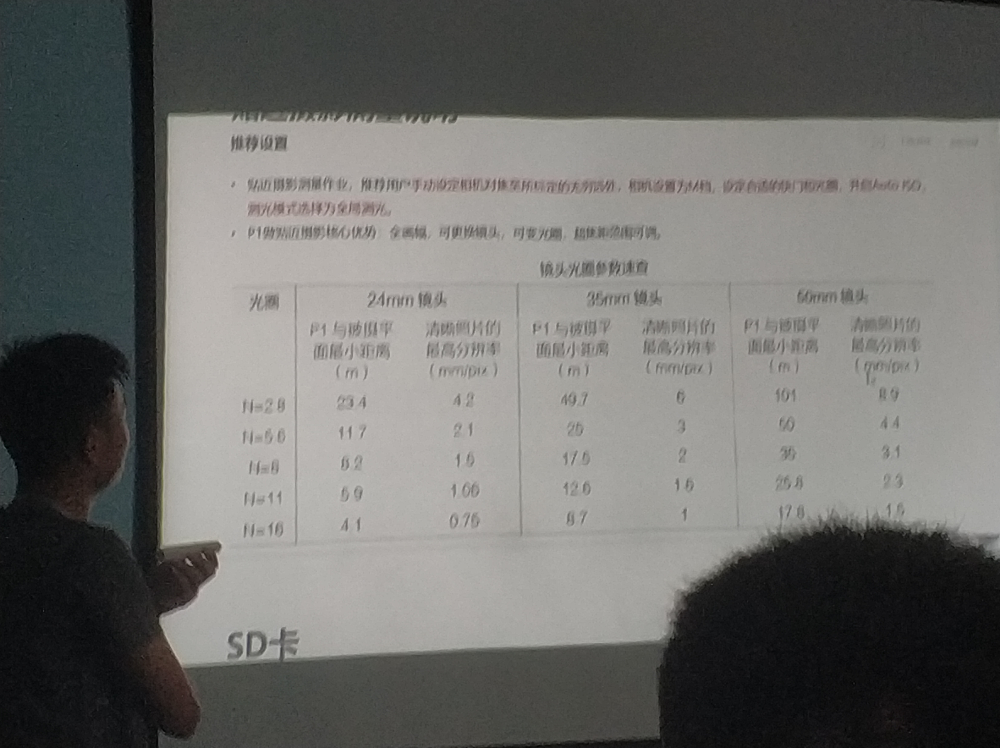
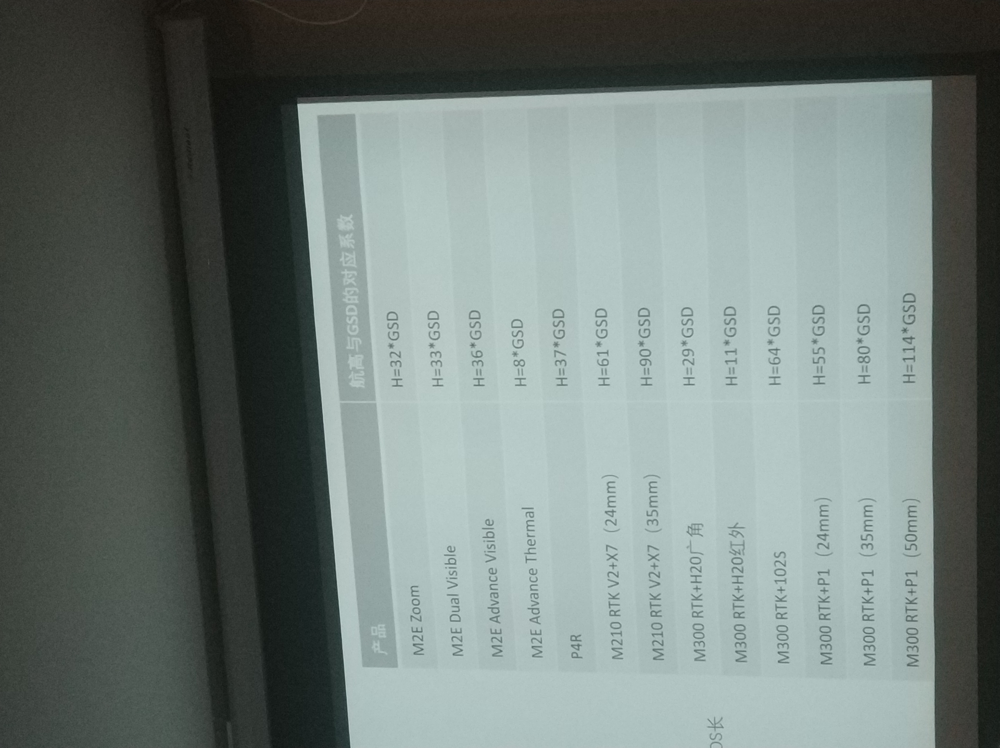

# 无人机精度计算

## GSD 是什么？

GSD，Ground Sample Distance，地面采样距离。通常用 n 厘米/像素表示。

$$
\frac{H}{GSD} = \frac{f}{a}
$$

其中，H为飞行高度，单位m；f 为镜头的焦距，a为像元的大小。

## GSD 精度演算

### 精灵 4 RTK

GSD 为\(H/36.5\) cm/pixel，H 为飞行器相对于拍摄场景的飞行高度（单位：米）

| 飞行高度\(m\) | 精度\(cm/pixel\) |
| :--- | :--- |
| 100 | 2.74 |
| 36.5 | 1 |
| 3.65 | 0.1 |

### Zenmuse-p1

* 传感器尺寸（照片）：35.9×24 mm （全画幅）； 
* 传感器尺寸（最大视频尺寸）：34×19mm； 
* 有效像素：4500万； 
* 像元大小：4.4 μm
* DJI DL 24mm F2.8 LS ASPH（带遮光罩和配重环/滤镜），FOV 84°；
* DJI DL 35mm F2.8 LS ASPH（带遮光罩和配重环/滤镜），FOV 63.5°； 
* DJI DL 50mm F2.8 LS ASPH（带遮光罩和配重环/滤镜），FOV 46.8°

| 镜头 | GSD\(cm/pixel\) |
| :--- | :--- |
| 24mm | 54.5 |
| 35mm | 79.5 |
| 50mm | 113.6 |

则可换算对应的精度为

| 飞行高度 |  | 精度\(mm/pixel\) |  |
| :--- | :---: | :---: | :---: |
| 镜头 | 24mm | 35mm | 50mm |
| 100 | 18.3 | 12.6 | 8.8 |
| 50 | 9.2 | 6.3 | 4.4 |
| 10 | 1.8 | 1.3 | 0.9 |

注意：不同的镜头在不同距离应该搭配对应的光圈。

## 其他参考资料

